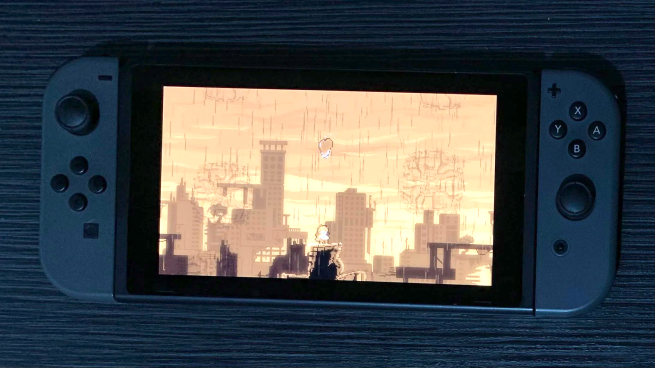

# Celeste ARM64 Utilities

This repository contains utilities for getting Celeste to work on ARM64 Linux. These utilities were tested on a Nintendo Switch running Ubuntu Bionic 18.04.



## Installation

**Note:** Read all of the instructions at least once before starting.

**Warning:** You must follow these instructions in the order they are presented.

1. Download the Linux version of Celeste [from itch.io](https://mattmakesgames.itch.io/celeste) or [from Epic Games Store](https://www.epicgames.com/store/en-US/p/celeste) to your computer. You have to use one of these versions of the game because the Steam version contains DRM.
2. Download the latest release of Celeste-ARM64 and extract it.
3. Run the following commands in a terminal.
```bash
cd /path/to/Celeste-ARM64
./patch.sh /path/to/celeste-linux/Celeste.exe
```
4. \(optional\) Install Everest in this copy of Celeste with Olympus.
5. Copy the Celeste folder to your Switch.
6. Run the following commands in a terminal on your Switch. You may be required to enter your password. After running this command, the installation will be complete and Celeste will start.
```bash
cd /path/to/celeste-linux
./Celeste
```
7. You should now be able to launch Olympus and Celeste using the app launcher.

## Files

### patch.sh

Use this script to make Celeste work on ARM64.

### fmod/

Contains instructions on how to get the FMOD library working. The FMOD library is used in Celeste for playing audio.

### otherlibs/

Contains a Makefile for building FNA3D, SDL and fmod_SDL.